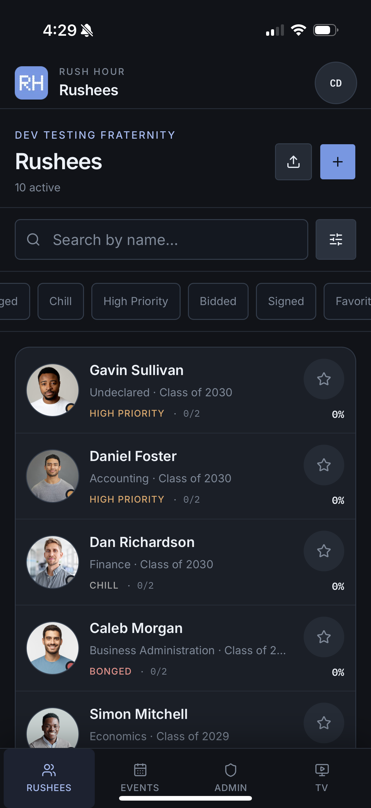
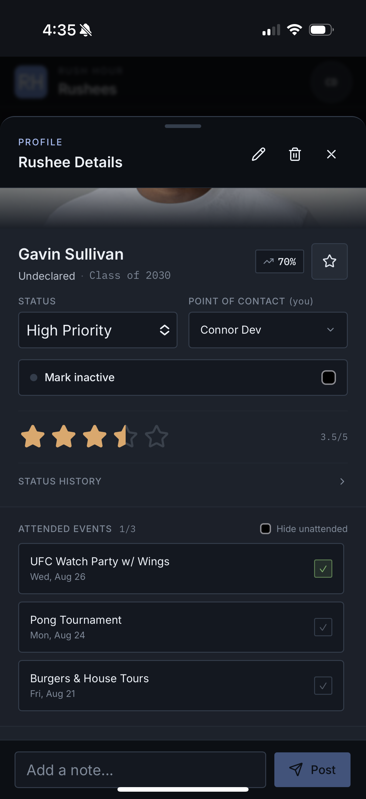
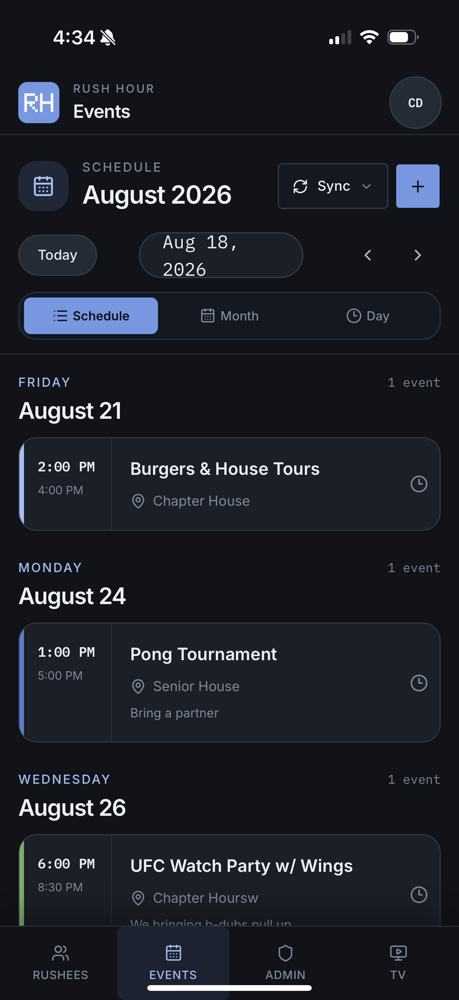
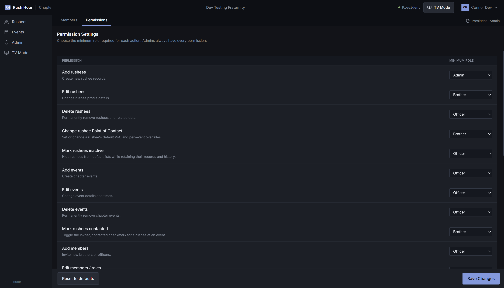

# Rush Hour

Recruitment management software for fraternities. A full-stack PWA that centralizes rush operations—from prospect pipelines and calendar sync to real-time voting during deliberation meetings.

**[See Website Here](https://fratrush.vercel.app)**

## Overview

Fraternity rush traditionally runs on scattered tools: spreadsheets, slide decks, text threads. Rushees fall through the cracks. Events double-book. There's no single source of truth. Rush Hour consolidates everything into one clean platform—currently in active use by real chapters.

## Screenshots
| | |
|---|---|---|---|
|  |  |  |  |
| *Rushees* | *Rushee Details* | *Schedule View* | *Permissions Settings* |

## Features

- **Rushee Pipeline** — CSV import/export. Track attributes (major, grad year, etc.) and apply dynamic statuses.
- **Deliberation Mode** — Distraction-free slideshow view for chapter voting and review meetings.
- **Member Feedback** — Secure login for brothers to comment, rate, and favorite candidates.
- **Smart Calendar** — Schedule, month, and day views with native Google and Apple Calendar sync.
- **Outreach Tracking** — Log contact points and event attendance per rushee so no one is forgotten.
- **Role-Based Access** — Four permission tiers (View Only, Brother, Officer, Admin) for flexible delegation.
- **Profile Archiving** — Mark inactive candidates to declutter without losing data.

## Tech Stack

| Category | Tech |
|----------|------|
| Frontend | Next.js, PWA |
| Styling | Tailwind CSS, Shadcn UI |
| Backend | Supabase, TanStack React Query |
| Deployment | Vercel |

## Roadmap

- Twilio/SendGrid integration for automated outreach
- Instagram integration (pending ToS compliance)

---

Built by Connor Koefelda
